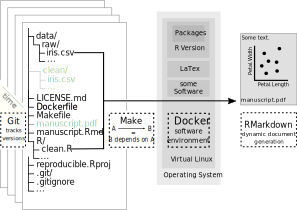

---
output:
  md_document:
    variant: gfm
---

```{r setup, include=FALSE}
knitr::opts_chunk$set(echo = TRUE)
library(here)
library(readr)
library(pander)
```

This is the accompanying GitHub repository to a work in progress paper by Aaron Peikert[](https://orcid.org/0000-0001-7813-818X) and Andreas M. Brandmaier [](http://orcid.org/0000-0001-8765-6982).

[](https://creativecommons.org/licenses/by/4.0) [](https://github.com/aaronpeikert/reproducible-research/issues/new) 

# Abstract

```{r abstract, child = 'abstract.Rmd'}
```

```{r, echo=FALSE}

```

# Resources

```{r, include=FALSE}
resources <- read_csv(here("data", "resources.csv"), trim_ws = FALSE)
```

```{r, echo=FALSE, asis=TRUE}
pander(
  resources,
  split.tables = Inf,
  split.cells = Inf,
  missing = "",
  keep.line.breaks = TRUE,
  style = "multiline"
)
```


# Compile

The following paragraphs describe how you can obtain a copy of the source files of our manuscript describing reproducible workflows, and create the PDF. Either, you can go the 'standard' way of downloading a local copy of the repository and knit the manuscript file in R, or you can use the reproducible workflow as suggested and use Make to create a container and build the final PDF file in exactly the same virtual computational environment that we used to render the PDF.

## Standard Way

Requires: `Git`, `RStudio`, `pandoc`, `pandoc-citeproc` & `rmarkdown`.

Open RStudio -> File -> New Project -> Version Control -> Git

Insert:

```
https://github.com/aaronpeikert/reproducible-research.git
```

Open `manuscript.Rmd` click on `Knit`.

## Using a Reproducible Workflow

Does not require R or RStudio, but `make` & `docker`.

Execute in Terminal:

```{bash, eval=FALSE}
git clone https://github.com/aaronpeikert/reproducible-research.git
cd reproducible-research
make build
make all DOCKER=TRUE
```

**Note: The build step may fail since services the build relies on are no longer available. In this case, you can download a ready build image from the [GitHub Releases](https://github.com/aaronpeikert/reproducible-research/releases/latest) and use `docker load -i reproducible-research.tar.gz` to load it. Continue with `make all DOCKER=TRUE`**

**Note: Windows user need to manually edit the `Makefile` and set current_path to the current directory and use `make all DOCKER=TRUE WINDOWS=TRUE`. We hope that future releases of Docker for Windows will not require that workaround.**

## Rebuild Everything

In case you experience some unexpected behavior with this workflow, you should check that you have the most recent version (`git pull`), rebuild the docker image (`make build`) and force the rebuild of all targets (`make -B DOCKER`).

```{bash, eval=FALSE}
git pull && make rebuild && make -B DOCKER=TRUE
```

# Session Info

```{r}
sessioninfo::session_info()
```
