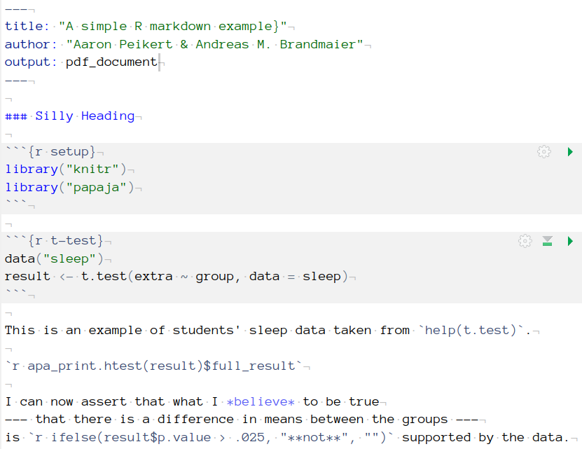
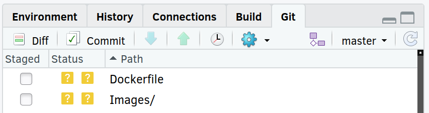
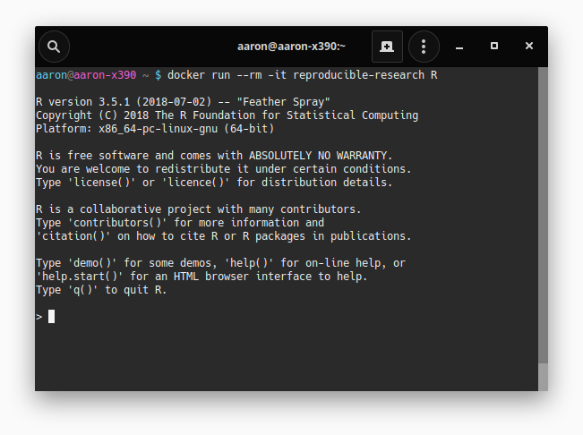
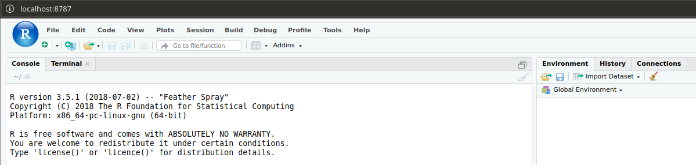

```{r setup, include=FALSE}
knitr::opts_chunk$set(echo = TRUE)
knitr::opts_chunk$set(linewidth = Inf) # see wrap_code.R

if(!require("pacman"))install.packages("pacman")
pacman::p_load("here", "tidyverse")

knitr::read_chunk(here("R", "random.R"))
knitr::read_chunk(here("R", "bootstrap.R"))

source(here("R", "wrap_code.R"))
```

# Introduction

In this tutorial, we describe a workflow to ensure long-term and cross-platform reproducibility of
R-based data analyses. To us Reproducibility means that statistical results as well as their generating computational workflows are reported fully, and transparently, and remain sustainably available, such that a given workflow can be re-run by a different person later in time and the results will be identical to the ones intially reported [@herouxCompatibleReproducibilityTaxonomy2018; @claerboutElectronicDocumentsGive1992]. The need to ensure reproducibility directly follows from commonly accepted rules of good scientific practice [such as the guidelines of the German Research Foundation, @dfg2019]. Ensuring reproducibility is a prerequisite for replicability and a means to increase trustworthiness of empirical results [@epskamp2019rep].

Here, we combine four software tools, whose interplay can guarantee full computational reproducibility of data analyses and their reporting. There are various ideas on how to enhance reproducibility [@piccoloToolsTechniquesComputational2016], four of which we believe to be particularly important: literate programming: [@ruleTenSimpleRules2019], version control [@barbaHardRoadReproducibility2016], dependency management [@askrenUsingMakeReproducible2016], and containerization [@clyburne-sherinComputationalReproducibilityContainers2018]. We argue that only a workflow using all four concepts in unison can guarantee confidence in reproducing a scientific report. Various implementations of these concepts exist, but we consider the following four best suited for the R environment [@r2019]: for literate programming, R Markdown [@rmarkdown2019], for version control, Git [@chaconProGit2014], for dependency management, Make [@feldmanMakeProgramMaintaining1979], and for containerization, Docker [@merkelDockerLightweightLinux2014]. Each of these software solutions serves a valuable meta-scientific goal (reproducibility) and increases the researches' productivity. They all are highly flexible and powerful, so that mastering them fully, requires a considerable amount of practice. However, for our purposes, it is sufficient to master a valuable minimal subset of functions to ensure reproducibility of scientific analyses.

<!--To maximize chances of long-term reproducibility, proper documentation of all steps taken and their context is crucial since it answers the question "What steps have to be taken to reproduce the results?". The most precise documentation is computer code, and the most productive computer code is code that runs automatically without human interaction. This principle is what guided our use of R Markdown, Git, Make, and Docker.-->

# Disclosures 

This paper is fully reproducible using the workflow described in this paper. All materials, including the manuscript source and all R codes and files used to generate this manuscript, can be found on the accompanying GitHub repository: [https://github.com/aaronpeikert/reproducible-research/](https://github.com/aaronpeikert/reproducible-research/). 

# Project organization

The first step towards reproducibility is to create an R script or R Markdown file as primary entry point for the analysis that runs on a local computer without error and performs the main statistical analyses. Next, one needs to make sure that all files relevant for the analysis can be moved to another computer. To this end, it is recommendable that all files are within one folder (or enclosed subfolders within it) and all paths are relative to that folder. A robust solution to the problem of making sure that file access does not break across computing platforms are [RStudio projects](https://r4ds.had.co.nz/workflow-projects.html) and the `here` package [@here2017].

```{r, eval=FALSE}
# BAD
iris <- read.csv("/home/aaron/reproducible-research/data/iris.csv")
# GOOD
iris <- read.csv("data/iris.csv")
# BETTER
iris <- read.csv(here("data", "iris.csv"))
```

The folder where all the files reside that you need for analysis (code and data), is referred to as a 'project' (or sometimes as a 'research compendium'). Working with projects is particularly convenient with RStudio, an integrated development environment (IDE) for R. It is useful to organize a data analysis project in a way that strictly segregates (raw) data and code by placing them in directories called `data` and `R` [see Section 4 in @marwickPackagingDataAnalytical2018]; there are also tools that automatize the standardized creation of folder structures such as `workflowr` [@workflowr].

Sometimes external requirements make it impossible for the data to be stored and shared together with the scripts. In most of the cases we have seen, these are either space constraints or privacy considerations. In these cases, of course, unrestricted reproducibility is not guaranteed. If dividing data and scripts is unavoidable, we recommend validating all data files using checksums (also called a "hash", e.g., using the functions provided in package `digest` [@digest2019]) before analyzing them. To do this, a checksum must be created and stored at the time of the original analysis. At the time of reproduction, the current checksum must then be compared with the stored checksum to ensure data integrity.

```{r}
x <- data.frame(VAR1=c(1,2,3,4),VAR2=c(0,4,6,9) )
checksum <- digest::digest(x, "sha1")
if (checksum != "8e222b9b3616595dc3f5946f9eac101fbf1336dc"){
  warning("Mismatch between original and current data file!")
}
```

# Literate Programming

The translation of computational results into a human-readable summary, for example into a technical report, a presentation, or a journal manuscript, is time-consuming and error-prone. Typical errors result from copy\&paste mistakes, erroneous rounding, or missed updates of the manuscript when the computer code has changed. In order to not only create fully reproducible results but also fully reproducible reports, one needs to resort to the Literate Programming paradigm [@knuth1984literate], in which human-readable language and computer code are intermingled to create dynamic documents whose order follows the logic of thought rather then the order of the computer. R Markdown is a simple markup language to create dynamic documents with embedded chunks of R code that can be exported to standard formats such as documents (docx, rtf, epub), presentations (ppt, html) or websites (html) using the `knitr` package [@xie2015; @xie2019]. Several packages extend the functionality of knitr. Of particular note are the `papaja` package [@papaja2018], which offers additional functions to enable American Psychological Association (APA) style document formatting, including a journal-style final typeset format, and the `stargazer` package [@stargazer2018], which provides journal-ready tables and reports of statistical models.  Figure 1 illustrates R Markdown syntax using the `papaja` package and Figure 2 shows the resulting rendered document.




# Version Management

Fundamentally, reproducibility means that results remain identical if neither the script nor the data have changed. It is often not trivial to find out whether anything in a project has changed over time and if so, to "go back in time." The Git program enables you to do both. A good mental model for Git is that it takes a sequence of snapshots of all files it is supposed to track. In the language of Git, these snapshots are "commits." A commit represents a complete copy of the state of all tracked files. Each commit has a unique identifier (a hash) and a human-readable description (commit message). Going back to one state is as easy as traversing the history of all commits and switching to a given one; it is possible to visually track changes between different versions. This collection of snapshots is called a "repository," which ideally tracks your entire R project.

A typical Git workflow in the terminal looks like this:

```{bash, eval=FALSE}
git init # to initialize git in the current directory
git add ./data/iris.csv ./R/analysis.R # track specific files/changes
git commit -m "add data & analysis" # take snapshot with comment
# once script or data were changed, take a new snapshot
git commit -a -m "complete data colections" # add (-a) and commit all changes
```

To keep track of all changes on your local computer, you only need to use `git add` and `git commit` or `git commit -a` to add and commit at the same time. These commands need to be executed in the terminal, which you can access from within RStudio (`Shift + Alt + R`).  RStudio also offers a graphical user interface for Git and, quite likely, this interface is sufficient for almost every interaction with Git.



In a given Git project, you can inspect all changes (`git log`) and examine any previous state by stating the identifier of the commit to `git checkout`:

```{bash, eval = FALSE}
git log
git checkout 77db06f78e
```

Git also makes it particularly easy to share and collaborate on a project with other researchers. A popular service for sharing materials via Git is [GitHub](https://github.com). Just sharing Git repositories with the public is always free, private repositories (only visible to persons you invite) are [free for researchers](https://help.github.com/en/articles/applying-for-an-educator-or-researcher-discount). After creating a user account, one can create a new repository and GitHub provides information on how to upload your repository from the terminal, e.g., for our repository (here with user name 'aaronpeikert' and repository name 'reproducible-research'):

```{bash, eval=FALSE}
git remote add origin https://github.com/aaronpeikert/reproducible-research.git
git push -u origin master
```

`git push` or the green upward arrow in the Git pane (see Figure 3) uploads local updates. To download this Git repository to another computer, type into the terminal:

```{bash, eval=FALSE}
git clone https://github.com/aaronpeikert/reproducible-research.git
```

Git and GitHub can do even more to support you when collaborating with fellow researchers, for example, by providing a web interface to track issues and their status (open/closed/resolved) and further means to manage and merge multiple, parallel versions of code (such as branches, pull requests, or merges), but this is beyond the scope of this tutorial. In particular, GitHub's issue management can be leveraged as a post-publication platform to discuss manuscripts and their results [^1].
Another benefit of using Git and GitHub is that experimentation is highly encouraged since you can go back to any state quickly and even when you lose access to the file on your computer, everything is backed up on the GitHub servers. Further, one can reduce the liklihood of dead code accumulating (e.g., lines that have been commented out) because it is safe to simply remove unneeded code blocks and track the removal in Git.

GitHub allows you to archive a specific version of your repository in the form of a release. A release tags a commit, e.g., as "submission,"[^sub] "preprint," or "published," and archives also "binary" products of your code, e.g. the resulting pdf of the manuscript or the docker image (see [Containerization]). From such a release a DOI can be created, making it easier to reference it (see this [GitHub Guide](https://guides.github.com/activities/citable-code/)[^doi]).

[^1]: To comment on our paper, please add an issue to the GitHub repository of our paper: <https://github.com/aaronpeikert/reproducible-research/issues>.
[^doi]: [https://guides.github.com/activities/citable-code/](https://guides.github.com/activities/citable-code/)
[^sub]: We created an release for the submission: [https://github.com/aaronpeikert/reproducible-research/releases/tag/v0.1.1-submission](https://github.com/aaronpeikert/reproducible-research/releases/tag/v0.1.1-submission)

# Dependency Tracking and Management

Even when you have obtained a given version of a project with the aim to reproduce reported result and you can confirm that this version is unchanged, you may not know exactly how to reproduce the results because it may be unclear which files should be executed in which order. This is particularly the case when complex preprocessing pipelines are part of the computation and/or external dependencies are many. Handling such dependencies is easy with Make because it allows you to create (computational) recipes to (re-)create files.

A `Makefile` obeys the following scheme:

```{bash, eval=FALSE}
target: dependency1 dependency2
  command-to-create-target
```

A typical `Makefile` might look like this:

```{bash, eval=FALSE}
analysis.pdf: data/clean.csv
  Rscript -e 'rmarkdown::render("analysis.Rmd")'

data/clean.csv: R/clean.R data/iris.csv
  Rscript -e 'source("R/clean.R")'
```

The first line can be interpreted as follows: To create `analysis.pdf`, the file `analysis.Rmd`, which depends on `data/clean.csv`, needs to be rendered. This dependency is itself a target. To create `data/clean.csv`, `R/clean.R` and `data/iris.csv` are needed. If you type `make analysis.pdf`, Make first checks whether the dependencies do exist and, if not, creates them. Here, if `data/clean.csv` does not exist, Make creates it. Also, if one of the dependencies of a target is newer then the target itself, then Make updates everything that directly or indirectly depends on the target. Here, if `data\iris.csv` is newer then `data\clean.csv`, Make will attempt to recreate `data\clean.csv` first and then `analysis.pdf`. If there is a dependency which is missing, and there is no recipe to make it, Make stops with an error message. It is a convention to have the first target named `all`, which depends on everything. Then the command `make` without any argument automatically creates everything. The button `Build All` from within RStudio triggers this process (see Figure 4).


If you have followed our workflow as presented thus far, a fellow researcher is only three commands away from fully reproducing your analysis:

```{bash, eval=FALSE}
git clone https://github.com/sirfisher/iris.git
cd iris
make all
```

However, successful reproducibility relies on the crucial assumption that your computational environments are identically or sufficiently compatible, e.g., all software dependencies are installed (R and all additional R Packages) and no updates or other changes to the computational environment break or alter your analysis. As we will shortly see, ensuring full computational reproducibility requires one further level of documentation, that is, documentation of the computational environment.

# Containerization

Docker is a tool that allows encapsulation, sharing, and re-creation of a computational environment on most operating systems (Windows, macOS & Linux). Docker achieves these goals by setting up a virtual computer, on which it can execute well-defined series of commands (e.g., installing software). It then saves the resulting state of the virtual computer in what is called an "image." This image can be started and execute commands on the virtual computer, e.g., running `Rscript` or `make`. A running instance of an image is called a container. An image can be transferred and executed on any machine that has Docker installed. Irrespective of the machine that is executing the container, the computational environment is the same for the programs running inside the container. The most important advantage over traditional virtual machines is that containers are lightweight, that is, they start rapidly and do not need much storage space. Docker achieves this by reusing large parts of the host's operating system (the extend varies between Linux, macOS and Windows).

With the following example, we demonstrate why it is important to store the computational environment. Generally, with containers we would like to safeguard against changes to the computational environment with unexpected consequences, e.g., changes in the functionality or default options in packages or even in the R environment itself. While the R programming language is considered stable and much effort is put into backward compatibility, even basic functions like `sample()` (to randomly sample from a set) sometimes change their behavior from one version to another. To ensure reproducibility in analyses based on a computer's pseudo random number generator (PRNG), it is good practice to rely on fixed PRNG seeds, which are numeric values that set the PRNG into a deterministic state, i.e., the sequence of random numbers reproduces exactly. Consider the following R code to randomly draw five numbers between 1 and 10:

```{r,eval=FALSE}
set.seed(1234)
sample(1:10, 5)
```

The usual expectation is that this code delivers the same pseudo-random five numbers regardless of the operating system or R Version (due to `set.seed()`). Using Docker, we can start an image which contains the R Version 3.5.0, and execute the code there.

```{r random, eval=FALSE}
```

This outputs:

```{r, child="R/random35.md"}
```

Surprisingly in an image with a more recent version of R (3.6.1), this results in another sample despite the identical seed:

```{r random, eval=FALSE}
```

This outputs:

```{r, child="R/random36.md"}
```

Note that this is intended behavior as it is the result of a [bugfix](https://bugs.r-project.org/bugzilla/show_bug.cgi?id=17494) in the random number generator implemented from R 3.6.0 upwards. Now, such changes may strictly render analyses run on previous R versions not reproducible if they contain, e.g., multiple imputations, bootstrapping, simulations studies, graphics with random jitter, Bayesian estimations using sampling algorithms (such as Markov Chain Monte Carlo), or similar techniques that involve random sampling. We would like to illustrate this with a more concrete example (the full R code to reproduce this non-reproducibility is provided in the GitHub repository of this manuscript). We ran a linear regression model on a simulated dataset with two variables `x` and `y` with R's `lm()` function regressing `x` on `y`. Using the `boot` package [@boot], we bootstrapped the 95% confidence intervals around the regression coefficient estimate with 1000 bootstrap samples to evaluate whether zero was inside the confidence interval. To make the analysis reproducible, we set a random seed. We ran this once in R 3.5.0:

```{r bootstrap, echo=TRUE, eval=FALSE}
```

```{r, child="R/bootstrap35.md"}
```

Then, we ran the identical script with the identical seed in R 3.6.1:

```{r bootstrap, echo=TRUE, eval=FALSE}
```

```{r, child="R/bootstrap36.md"}
```

As we see from these R outputs, the confidence intervals once include zero and once do not. Please note that one could discuss deeper issues about null hypothesis significance testing here but with this example, we would simply like to stress the point that computational reproducibility in the strict sense requires capturing the full computational environment. 

Only rarely does an analysis depend on base R only. Often, a considerable number of packages is required, and the addition of each package will increase the likelihood of breaking reproducibility with every update to any of the packages of base R. The whole endeavor of reproducibility is therefore at stake every time an update is rolled out. To ensure long-term reproducibility, Docker replicates the original computational environment of an analysis exactly. Note that we do not intend to advocate that software should not be updated; updates typically promote bugfixes and provide new functionality; our point is that full computational reproducibility is only achieved if the originally used software versions are documented. Among other things, this makes it possible to trace back recent updates as to what change in what package caused a non-reproduction of the original results. Quite to the contrary, with solutions like Docker, it gets easier than ever to safely update to new versions just by changing the R version number of the Docker image. This convenience is possible because of the efforts of the [Rocker project](https://GitHub.com/rocker-org/rocker) [@boettigerIntroductionRockerDocker2017a], which provides Docker images preconfigured with an R-installation of given R versions. These packages are taken from MRAN [@revolutionanalyticsReproducibilityUsingFixed2019], a repository for R packages fixed to the last date on which the R version of the image was the most recent. Building upon these Rocker images, researchers can easily build their own Docker images with all required R packages. The rocker project also provides images that include RStudio (`rocker/rstudio`), the `tidyverse` package (`rocker/tidyverse`) and the R Markdown package with LaTeX (`rocker/verse`). Because our workflow relies on R Markdown, we suggest using the `rocker/verse` image (which also contains `rstudio` & `tidyverse`). These images are stored on [Dockerhub](https://hub.docker.com) [@dockerinc.DockerHub2019].

Building on a basic Rocker image, we can specify further requirements for software in a Dockerfile. For example, the basis for this article's Docker image is the following Dockerfile:

```{bash, eval=FALSE}
FROM rocker/verse:3.6.1
RUN install2.r --error --skipinstalled\
  pacman here pander
RUN installGithub.r\
  crsh/papaja benmarwick/wordcountaddin
WORKDIR /home/rstudio
```

The `FROM` statement specifies which Docker image to use, in this case, the `rocker/verse` image with the tag 3.6.1 (referring to the R version 3.6.1). The `RUN` statement describes a command to execute, in this case, to run an R script `install2.r` which is available on all Rocker images, to install the specified packages (here, `pacman`,  `here` & `pander`). A Dockerfile allows more than one `RUN` statement, executing arbitrary system commands. Those `RUN` statements can install dependencies that are not an R package, e.g., other programming languages like python or Matlab. The `WORKDIR` statement is not strictly necessary but saves time spent on writing the working directory. The command `docker build -t image-name` creates an image named `image-name` from the Dockerfile in the project. A way to identify the dependencies automatically and generate a docker image out of them is provided in the [`liftR`](https://cran.r-project.org/web/packages/liftr/vignettes/liftr-intro.html) package [@liftr].

There are two ways to share a Docker image; either by sharing the Dockerfile that creates the image, or by sharing the image itself, e.g., through a service like [Dockerhub](https://hub.docker.com). While both ways guarantee a replicable computational environment, sharing the Dockerfile is more transparent; in our workflow, we can use Git to track changes in the Dockerfile (such as updates to dependencies). 

There are two options to interact with a container. Both options are based on the `docker run` command. The first way is to run a command inside the container. The call takes the form:

```{bash, eval=FALSE}
docker run --rm -it <IMAGENAME> <COMMAND>
```

The `--rm` flag means that the state of the container after the command finishes is not saved. The `-it` flag tells Docker to accept inputs and return outputs to the terminal. Interacting with docker this way is especially useful when using `R` as a command because you then have access to the standard R terminal. This is the command to start an interactive R session inside a Docker image called `reproducible-research`:

```{bash, eval=FALSE}
docker run --rm -it reproducible-research R
```



The second option is to start the container in the background (not supplying a specific command) and to interact with the container via the webrowser and the RStudio server instance running in it. In order to do so, you need to supply a password to log into the RStudio server (`-e PASSWORD=<YOUR_PASS>`) and open a port (`-p 8787:8787`).

```{bash, eval=FALSE}
docker run -e PASSWORD=<YOUR_PASS> -p 8787:8787 image-name
```

The adress to connect to the RStudio server is your IP address (or `localhost` Linux) in this scheme: `<IPADRESS>:8787`. This offers a fully functioning RStudio instance that runs in the image but is accessible through a local web browser.

By default, programs inside the container cannot access files on the local computer, thus requiring an explicit link to a local folder to enable access (and on macOS and Windows this also have to be allowed in the settings) :

```{bash, eval=FALSE}
docker run -v /folder/on/your/computer:/folder/in/docker 
```

The main directory for RStudio inside the container is `/home/rstudio`, so the final call to start RStudio inside a Docker container may look like this:

```{bash, eval=FALSE}
docker run --rm -it -e PASSWORD=<YOUR_PASS> -p 8787:8787 -v
/path/to/project:/home/rstudio reproducible-research
```



Since Docker commands tend to grow long and become tedious to type manually, we recomend using some automatic way to generate them. Fortunately, one can use Make to automatically generate the `docker` commands, e.g. the (simplified) `Makefile` for this paper allows command after `$(run)` to be conditionally passed through Docker if one types `make DOCKER=TRUE` (otherwise, they are run locally):

```{bash, eval=FALSE}
projekt := $(notdir $(CURDIR))
current_dir := $(CURDIR)
home_dir := $(current_dir)
uid = --user $(shell id -u)

ifeq ($(DOCKER),TRUE)
	run:=docker run --rm --user $(uid) -v $(home_dir):/home/rstudio $(projekt)
	current_dir=/home/rstudio
endif

all: manuscript.pdf

build: Dockerfile
	docker build -t $(projekt) .

manuscript.pdf: manuscript.Rmd reproducible-research.bib
	$(run) Rscript -e 'rmarkdown::render("$(current_dir)/$<")'
```

# Installing and Setting Up the Workflow

Other than on R, RStudio, and R Markdown, our workflow relies on three pieces of software from outside the R environment: Git, Make, and Docker. The installation process of these software packages depends on the operating system, e.g., on macOS, Make is always available, while on Linux, Git and Make are often already installed. In the following section, we share what what we consider the easiest way to install those packages. However, installation processes may be subject to change, and we advise that readers also consult the documentations of the packages.

## Windows

Windows systems typically require the biggest efforts to install all necessary software. Note that you have to have Windows Pro, Enterprise, Education or Server installed, as Microsoft prevents the use of Docker on Windows Home. There is a package manager for Windows called Chocolatey, which you can install from: [https://chocolatey.org/install](https://chocolatey.org/install), providing all dependencies.
Having installed Chocolatey (and restarted the computer), all dependencies can be installed in an **admin terminal** (Windows key, then type `cmd`, right-click *Run as administrator*) via:

```{bash, eval=FALSE}
choco install -y git make docker-desktop
```

To use `docker` you need to start Docker Desktop. In the settings of Docker Desktop you have to allow the sharing of your drive. Docker on Windows require the path to be special; therefore you need to hand edit the `Makefile` and set `current_path` to the current directory and use `make all DOCKER=TRUE WINDOWS=TRUE`. We hope that future releases of Docker for Windows will not require that workaround.

## macOS

As Make already ships with macOS, you only need Git and Docker. We suggest using the package manager Homebrew, which you can install from [https://docs.brew.sh/Installation](https://docs.brew.sh/Installation), to install Docker (Git will be installed during the installation of Homebrew):

```{bash, eval=FALSE}
brew cask docker
```

To use `docker` you need to start Docker Desktop. In the settings of docker you have to allow the sharing of your drive.

## Linux

There is a host of different Linux distributions and almost as many package managers. Still, to our knowledge, there is no (recent) Linux edition, that does not include Git, Make and Docker. For example, in Ubuntu Linux, installation is straightforward using the shipped package manager:

```{bash, eval=FALSE}
apt install git make docker 
```

For other distributions, replace `apt` with the native package manager. You may need elevated rights for the installation; in this case add `sudo` before the installation command. `docker` also needs elevated rights to run; therefore, we recommend adding the local user to the `docker` group, following the [documentation of Docker](https://docs.docker.com/install/linux/linux-postinstall/#manage-docker-as-a-non-root-user).

An alternative to Docker on Linux is Singularity [@kurtzerSingularityScientificContainers2017]. Just replace any docker calls with `singularity docker`, because singularity fully supports docker images. A possible advantage is that singularity works well in high-performance computing environments and on old Linux versions, the downside is that Singularity is only available on Linux.

## Reproducing an Analysis

We provide a reproducible analysis as a working example via [GitHub](https://github.com/aaronpeikert/workflow-showcase) as a testbed for users. The example shows a minimalistic analysis of the 'Considerations of Future Consequences (CFC) Scale'. The analysis demonstrates a successful implementation of our workflow including downloads of external data, comparison of their integrity using a checksum, and the running of a confirmatory factor analysis on the first few items using `lavaan` [@lavaan2012]. Once all mentioned tools are installed on a computer, the following few steps are necessary to reproduce our analysis:

```{bash, eval=FALSE}
git clone https://github.com/aaronpeikert/workflow-showcase.git
cd workflow-showcase
make build
make all DOCKER=TRUE
```

# Summary

The overarching goal of this paper was to provide a complete and easy-to-use workflow that allows confidence in reproducibility of R-based data analyses. Analyses following our workflow can be reproduced with four commands (here shown for our paper):

```{bash, eval=FALSE}
git clone https://github.com/aaronpeikert/reproducible-research.git
cd reproducible-research
make build
make all DOCKER=TRUE
```

That is, this reproduces a scientific report exactly without regard to the user, the operating system, the software, the timepoint, or interim changes to the involved files. To that end, the proposed workflow relies on tools that have been the foundation of reliable software development for years or, even decades. As a by-product, it makes transparent how statistical results depend on the software that created them and, by virtue of this transparency, facilitates later re-use by other researchers. 

Each tool in the workflow reduces the chances of non-reproducibility. Dynamic reporting with R Markdown guarantees consistency between computational results and their reporting; Version control with Git ensures permanence and consistency across multiple versions of data and code; Dependency management with Make affirms defined entry-points and dependency resolution; containerization with Docker secures reproducibility of the full computational environment. We believe that this tightening of loose ends does not restrict researchers but enables them to operate on a solid basis to deliver sound and sustainable research.

## Related approaches

While our approach was designed to scale well with the complexity of a computing-intense project, we realise that this flexibility may not be straightforward to integrate into a researcher's everyday workflow. There are R packages that implement parts of our workflow and, thus, lower the threshold for adoption when the full flexibility provided by our workflow is not needed. The use of R Markdown within a project, tracked with Git can be simplified with the [`workflowR`](https://github.com/jdblischak/workflowr) package [@workflowr]. The [`drake`](https://github.com/ropensci/drake) package [@drake] is directly inspired by Make but can only handle dependencies within R. The [liftR ](https://cran.r-project.org/web/packages/liftr/vignettes/liftr-intro.html) package [@liftr] and the [`holepunch`](https://karthik.github.io/holepunch/) package [@holepunch] automatize the use of Docker. The former is perfectly compatible with the described workflow and we recommend it to users  who are not comfortable with command-line use of Docker. `holepunch` uses [binder](https://mybinder.org) [@binder2018] to move the analysis to the cloud, so that no local installation of Docker is required. `holepunch` is well suited for simple analysis with low computational demands, because binder's  memory and computing time is limited. There are several alternatives to Docker that manage dependencies on R packages. [`packrat`](https://rstudio.github.io/packrat/) [@packrat] is a way to freeze package version via local copies of packages in the project, but it does not gurantee a given base R version or system dependencies. Similar approaches are taken by [`jetpack`](https://github.com/ankane/jetpack) [@jetpack], [`miniCRAN`](https://cran.r-project.org/web/packages/miniCRAN/vignettes/miniCRAN-introduction.html) [@miniCRAN] and [`checkpoint`](https://cran.r-project.org/web/packages/checkpoint/vignettes/checkpoint.html) [@checkpoint]. The package [`reprex`](https://github.com/tidyverse/reprex) [**repr**oducible **ex**ample, @reprex] is also worth noting, but its scope is limited.

Another way to increase the chance of reproducibility is to develop an R package, which is a self-contained set of files with well-defined meta-data, for each analysis. The reasoning is that, abiding by the strict rules of package development and specifying all dependencies can archieve a high degree of stability can be achieved [e.g., @marwickPackagingDataAnalytical2018].

Other than these tools, which ease the process of creating workflows like ours does, we have noticed increased interest in changing the way research is published and used [@perkelToolkitDataTransparency2018], with the emergence of *life code* [@perkelPioneeringLivecodeArticle2019] and *continuous integration* [@beaulieu-jonesReproducibilityComputationalWorkflows2017; @yenniDevelopingModernData2018]. These techniques give us a glimpse of a paradigm shift from static to dynamic, interactive, and living publications that is yet to happen.

## Limitations

We are aware that implementing the proposed workflow is not straightforward and the difficulty of its implementation may vary by platform. For example, already the installation of all tools is already easier on POSIX-compatible platforms such as Unix, Linux, or macOS (but not Windows). However, once a reproducible workflow is established as a default, it can be used with minimal changes from project to project. 

In our own experience, it is often not possible to convince all co-authors to switch to a different document processing environment, such as R Markdown. That is, we have experienced the case that after writing up the first draft in R Markdown, we eventually had to generate a Word file that, from then on, was used as static file serving as a basis for multiple iterations among the co-authors. Retaining reproduciblity in such situations then requires tedious manual synchronization of files across formats. This annoyance may be reduced with the [`redoc` package](https://noamross.github.io/redoc/articles/mixed-workflows-with-redoc.html) [@redoc], which enables a bidirectional synchronization between Word and R Markdown. Conversions between R Markdown and Word retain all changes and even support Word's track-changes feature.

## Sharing reproducible workflows

How can one best share a reproducible workflow? We believe that, ideally, a non-commercial public service provider should be found that guarantees permanent and reliable hosting of our reproducible workflows, such as the Open Science Framework [@fosterOpenScienceFramework2017]. A provider mirroring and complementing the services offered by GitHub, Docker Hub, and MRAN would be desirable. Second, to ensure that other users are legally able to benefit from the shared materials, authors must choose an appropriate license format. Typically, there is currently no single license that works for code, data, and media (such as text or figures). We encourage authors to choose appropriate license forms that do not hinder others from freely downloading, using, and modifying the shared workflows and materials while, at the same time, ensuring recognition for the time and effort invested into creating the workflow in the first place. In our experience, the Creative Commons license (CC-BY) is often appropriate for sharing texts, R Markdown files, generated figures, and other media, whereas scripts and any other computer code are often best shared according to the MIT license. Both licenses assure maximal freedom for future users while requiring the attribution of the original authors in derivative work. These licenses are also in line with the recommendations by the Reproducible Research Standard [@stoddenEnhancingReproducibilityComputational2016; @stoddenEnablingReproducibleResearch2009]. To facilitate an inclusive environment we recommend naming all contributors and including a [Code of Conduct](https://opensource.guide/code-of-conduct/) in your project.

## Outlook

The proposed workflow leverages various existing tools that are partly integrated into RStudio already. Parts of the proposed workflow have been integrated into stand-alone packages (such as workflowr [@workflowr] or holepunch  [@holepunch]) but they are either incomplete in the sense of our proposal or rely heavily on propietary service providers. We hope that with increasing awareness of the challenges of computational reproducibility, the increased demand for unified and open solutions will lead to an even better integration of existing tools to allow reproducible workflows to become a standard in psychological research.

\newpage

## Author Contributions

Aaron Peikert and Andres Brandmaier jointly generated the idea for the manuscript. Aaron Peikert implemented the workflow. Aaron Peikert and Andreas Brandmaier jointly generated the R code examples. Aaron Peikert wrote the first draft of the manuscript, and both authors critically edited it. Both authors approved the final submitted version of the manuscript.

## Conflicts of Interest

The authors declare that there were no conflicts of interest with respect to the authorship or the publication of this article.

\newpage

# References

\begingroup
\setlength{\parindent}{-0.5in}
\setlength{\leftskip}{0.5in}

<div id = "refs"></div>
\endgroup
